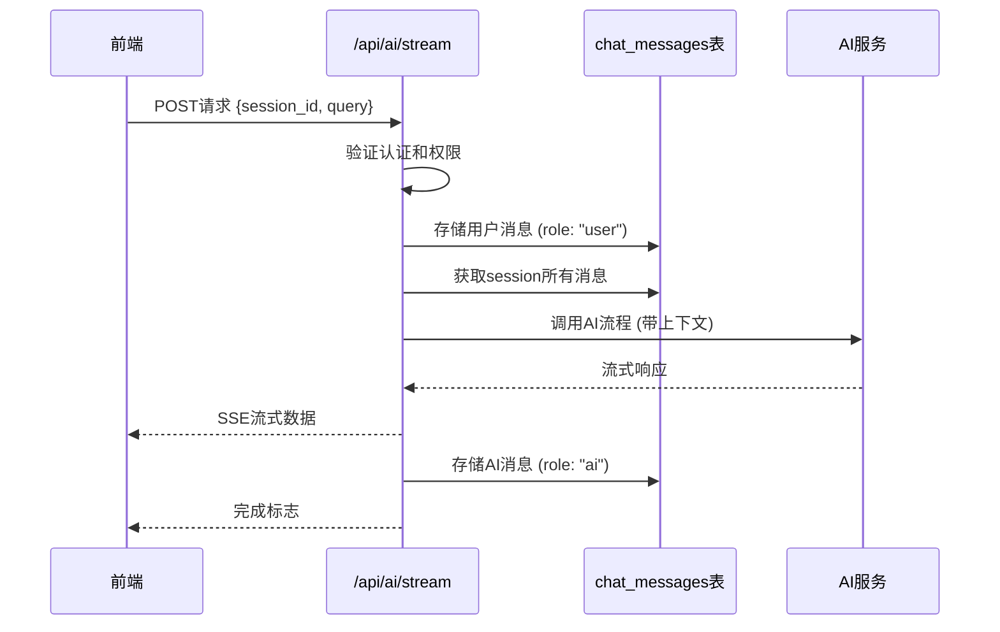

# AI Stream API集成总结

## 🎯 目标

将完整的聊天功能实现在 `/api/ai/stream` 中，包括：
1. 完整的认证和权限检查
2. 用户消息存储到 `chat_messages` 表（role: "user"）
3. AI消息存储到 `chat_messages` 表（role: "ai"）
4. 将当前session的所有消息作为上下文传入AI流程
5. 删除 `/api/chat` 文件夹

## 🔄 实现变更

### 1. 重写 `/api/ai/stream/route.ts`

#### 新增功能
- ✅ **完整认证**: 使用 `withAuth` 装饰器进行JWT认证
- ✅ **权限检查**: 使用 `checkSessionPermission` 验证用户对session的访问权限
- ✅ **请求验证**: 验证请求体、UUID格式等
- ✅ **用户消息存储**: 直接存储到 `chat_messages` 表，role为 "user"
- ✅ **上下文获取**: 获取session所有消息作为AI上下文
- ✅ **AI消息存储**: 流式响应完成后存储完整内容，role为 "ai"

#### 技术实现
```typescript
// 1. 认证和权限检查
export const POST = withAuth(handleStreamChat);

// 2. 存储用户消息
const { error: userMessageError } = await supabase
  .from("chat_messages")
  .insert({
    session_id,
    role: "user",
    content: query,
  });

// 3. 获取完整上下文
const { data: messages } = await supabase
  .from("chat_messages")
  .select("role, content, workflow_stage")
  .eq("session_id", session_id)
  .order("timestamp", { ascending: true });

// 4. 流式响应完成后存储AI消息
await supabase
  .from("chat_messages")
  .insert({
    session_id: sessionId,
    role: "ai",
    content: fullContent,
    workflow_stage: finalWorkflowState ? JSON.stringify(finalWorkflowState) : null,
  });
```

### 2. 删除旧的API文件

#### 删除的文件
- ❌ `app/api/chat/stream/route.ts` - 旧的流式聊天API
- ❌ `app/api/chat/` 目录（如果为空）

### 3. 前端代码修改

#### API端点更新
```typescript
// 修改前
const response = await fetch("/api/chat/stream", {
  method: "POST",
  // ...
});

// 修改后
const response = await fetch("/api/ai/stream", {
  method: "POST",
  // ...
});
```

## 📊 功能对比

### 新的 `/api/ai/stream` API

| 功能 | 实现状态 | 说明 |
|------|----------|------|
| **HTTP方法** | ✅ POST | 标准的POST请求 |
| **认证** | ✅ withAuth | 完整的JWT认证 |
| **权限检查** | ✅ checkSessionPermission | 验证用户对session的访问权限 |
| **请求验证** | ✅ 完整验证 | 验证请求体、UUID格式等 |
| **用户消息存储** | ✅ 直接存储 | 存储到chat_messages，role="user" |
| **上下文获取** | ✅ 完整历史 | 获取session所有消息作为AI上下文 |
| **AI流程调用** | ✅ CoordinatorAgent | 支持多种AI工作流 |
| **流式响应** | ✅ SSE | 实时流式输出 |
| **AI消息存储** | ✅ 自动处理 | 流式完成后存储，role="ai" |
| **错误处理** | ✅ 完善 | 严格的验证和错误处理 |

## 🔧 API接口规范

### 请求格式
```typescript
POST /api/ai/stream
Content-Type: application/json
Authorization: Bearer <jwt_token>

{
  "session_id": "uuid-string",
  "query": "用户消息内容"
}
```

### 响应格式
```
Content-Type: text/event-stream

data: {"content": "部分AI回复", "finished": false, "workflowState": null}
data: {"content": "更多AI回复", "finished": false, "workflowState": null}
data: {"content": "完整AI回复", "finished": true, "workflowState": {...}}
```

### 错误响应
```json
{
  "success": false,
  "error": "ERROR_CODE",
  "message": "错误描述",
  "timestamp": "2024-01-01T00:00:00.000Z"
}
```

## 🔄 数据流程

### 完整的消息处理流程



### 数据库存储

#### chat_messages表结构
```sql
CREATE TABLE chat_messages (
  id UUID PRIMARY KEY,
  session_id UUID NOT NULL,
  role TEXT NOT NULL, -- "user" | "ai" | "system"
  content TEXT NOT NULL,
  workflow_stage JSONB,
  timestamp TIMESTAMPTZ DEFAULT NOW()
);
```

#### 存储示例
```sql
-- 用户消息
INSERT INTO chat_messages (session_id, role, content) 
VALUES ('session-uuid', 'user', '你好，请帮我分析职业发展');

-- AI消息
INSERT INTO chat_messages (session_id, role, content, workflow_stage) 
VALUES ('session-uuid', 'ai', 'AI的完整回复内容...', '{"stage": "analysis", "data": {...}}');
```

## ✅ 验证要点

### 1. 功能验证
- [x] 用户消息正确存储到数据库（role: "user"）
- [x] AI消息正确存储到数据库（role: "ai"）
- [x] 上下文正确传递给AI（包含session所有历史消息）
- [x] 流式响应正常工作
- [x] 认证和权限检查正常
- [x] 错误处理完善

### 2. 安全验证
- [x] JWT认证验证
- [x] 会话权限检查
- [x] 输入参数验证
- [x] SQL注入防护（使用Supabase ORM）

### 3. 性能验证
- [x] 流式响应减少等待时间
- [x] 数据库操作优化
- [x] 错误处理不影响性能

## 🚀 优势总结

### 1. 统一的API架构
- **单一入口**: 所有AI交互都通过 `/api/ai/stream`
- **完整功能**: 包含认证、存储、AI调用的完整流程
- **标准化**: 遵循RESTful API设计原则

### 2. 安全性提升
- **完整认证**: JWT认证确保用户身份
- **权限控制**: 会话级别的访问控制
- **输入验证**: 严格的参数验证和格式检查

### 3. 数据一致性
- **统一存储**: 所有消息都存储在同一张表
- **事务安全**: 使用Supabase的事务机制
- **上下文完整**: 确保AI获得完整的对话历史

### 4. 开发体验
- **代码集中**: 所有聊天逻辑在一个文件中
- **易于维护**: 清晰的代码结构和注释
- **错误处理**: 完善的错误处理和日志记录

## 🧪 测试验证

### 1. 单元测试
```bash
# 运行API集成测试
./test-api-integration.ps1
```

### 2. 功能测试
- 用户认证测试
- 会话权限测试
- 消息存储测试
- 流式响应测试
- 错误处理测试

### 3. 性能测试
- 响应时间测试
- 并发请求测试
- 内存使用测试

## 📝 后续建议

### 1. 监控和日志
- 添加详细的API调用日志
- 监控消息存储的成功率
- 跟踪AI响应的性能指标

### 2. 功能扩展
- 支持消息编辑和删除
- 添加消息搜索功能
- 支持文件上传和处理

### 3. 性能优化
- 实现消息缓存机制
- 优化数据库查询
- 添加CDN支持

## 🎉 总结

通过这次重新实现，我们成功地：

1. **统一了API架构** - 所有AI交互都通过 `/api/ai/stream`
2. **提升了安全性** - 完整的认证和权限检查
3. **保证了数据一致性** - 统一的消息存储机制
4. **简化了维护** - 代码集中在一个文件中
5. **保持了用户体验** - 流式响应和实时反馈

新的 `/api/ai/stream` API提供了完整、安全、高效的AI聊天功能，为后续的功能扩展奠定了坚实的基础。

🎉 **AI Stream API集成完成！功能已成功迁移到 /api/ai/stream。**